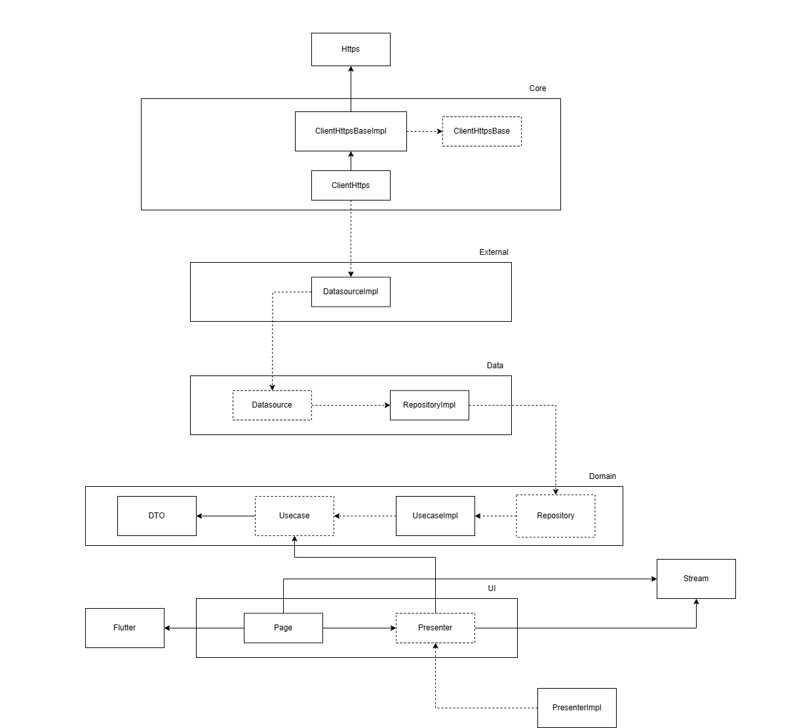
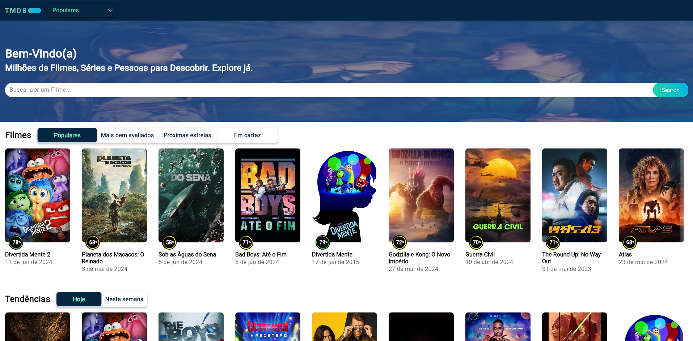
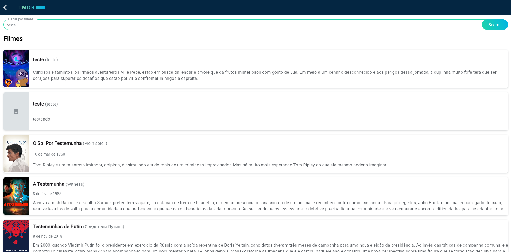
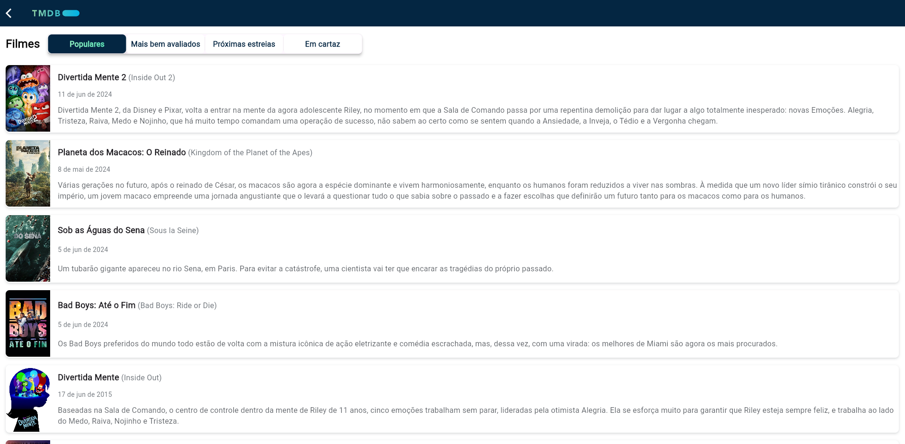
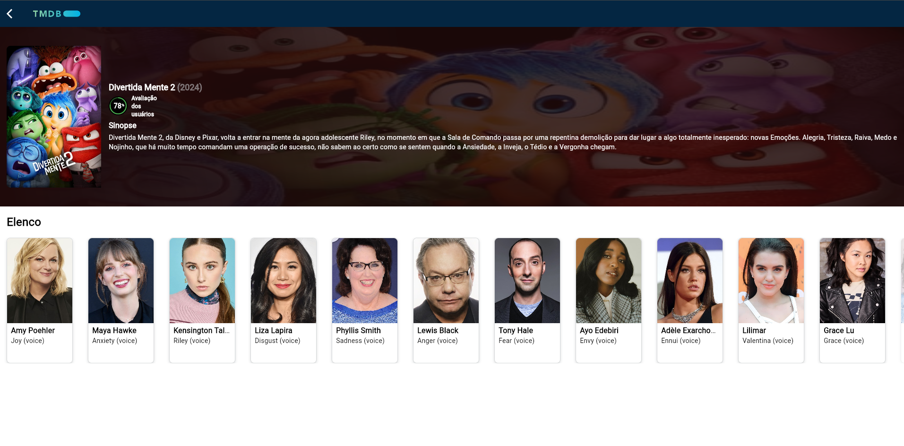
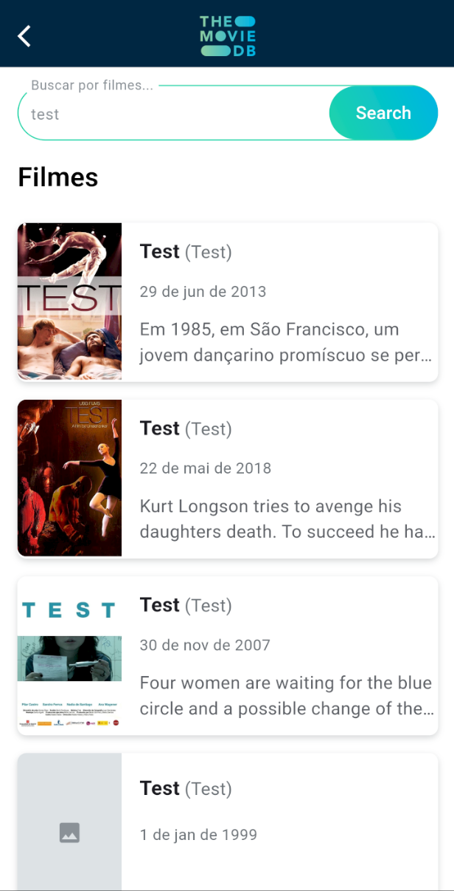
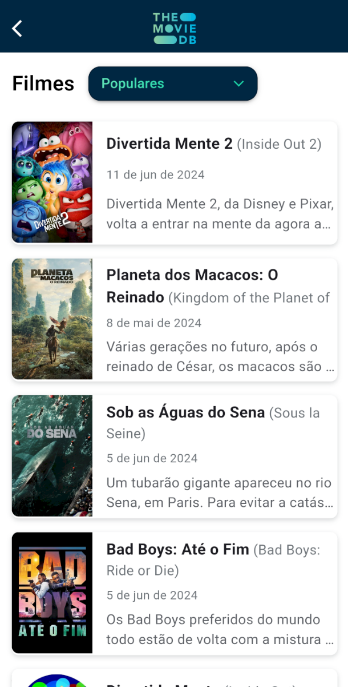
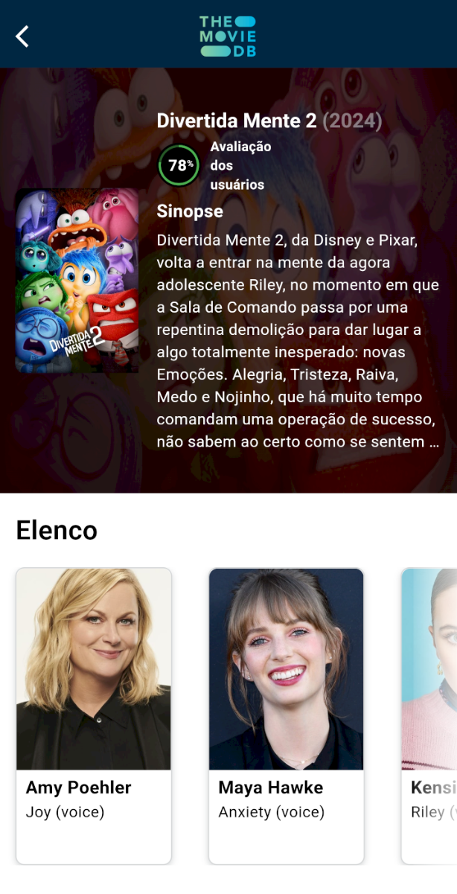

  <row>
    
    
  </row>

  <h3>The Movie DB Clone App</h3>
  
The Movie DB Clone is a mobile/web responsive application in development using Flutter. This application presents media information (series and films), research and notes for each of them.

 

## Overview
1. **[Requirements 📝](#requirements-)**
2. **[Developing 👷](#developing-)**
3. **[Releasing 🏷️](#releasing-)**
4. **[Architecture Diagram ⚙️](#architecture-diagram-)**
5. **[App Images 📱](#app-images-)**

## Requirements 📝
#### To execute this project it is necessary to have the following dependencies installed and configured on your machine:

**Required**
- [Flutter](https://flutter.dev/)
- [Android SDK](https://developer.android.com/studio)
- [IOS SDK](https://developer.apple.com/xcode/)

**Versions**
- [Flutter](https://flutter.dev/) `3.22.0`
- [Dart](https://dart.dev/) `3.4.0`

## Developing 👷
#### Use a local development environment:

1. [Clone this repo](https://docs.gitlab.com/ee/gitlab-basics/start-using-git.html) with git.
2. Install dependencies by running `flutter packages get` or `flutter pub get` within the directory that you cloned (probably `app`).
3. Open any mobile device emulator of your choice our selected the chrome application.
4. Execute your app with `flutter run` or F5 (debug mode), if you want execute in specific platform execute `flutter run -d {device}` (e.g., chrome), with you want execute in specific port use `flutter run -d web-server --web-port=8080` and type http://localhost:8080 in any navigator.

#### Git Flow
- Commits are done in **EN-US** , following [Conventional Commits](https://www.conventionalcommits.org/en/v1.0.0/) format. For example:
  - feat(scope): description of new feature
  - refactor(scope): description of activity
  - docs(scope): description of document added
  - fix(scope): description of fixed function
  - chore(scope): other files (e.g., generated files)
  - test(scope): description of test
- Branch:
  - Fixed branches
    - main: contains all the code that will be delivered to the client, already tested and passed through all quality stages.
    - develop: contains the entire workflow that will occur throughout the project, meaning all work from other branches should go into develop.
  - Creation of branches
    - To create a new branch, it's necessary to create it from a task that will be done. For example:
      - feat/dashboard-integration
      - refactor/movies-usecase
      - fix/modules-exception
      - docs/git-flow
      - chore/dependencies

## Releasing 🏷️

1. [Clone this repo](https://docs.gitlab.com/ee/gitlab-basics/start-using-git.html) with git.
2. Install dependencies by running `flutter packages get` or `flutter pub get` within the directory that you cloned (probably `app`).
3. Build the release files with `flutter build apk` our `flutter build web`.
4. Find the your release in `build/app/outputs/apk/release` or `build/app/outputs/flutter-apk/release`.

## Architecture Diagram

This architecture is based in Clean Architecture and SOLID principles, and the UI layer is based in MVP principles.
Below is an image of the architecture.

  <row>
    
  </row>

## App Images

This section shows images of application in the different's dimensions.

  <row>
    
  </row>

  <row>
    
  </row>

  <row>
    
  </row>

  <row>
    
  </row>

  <row>
    
  </row>

  <row>
    
  </row>

  <row>
    
  </row>

  <row>
    
  </row>

